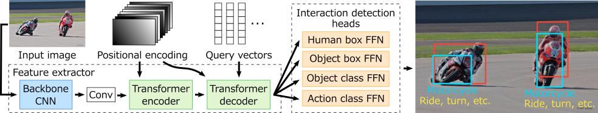
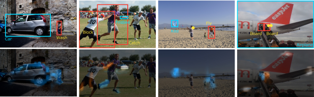

# QPIC: Query-Based Pairwise Human-Object Interaction Detection with Image-Wide Contextual Information
by [Masato Tamura](https://scholar.google.co.jp/citations?user=IbPzCocAAAAJ), [Hiroki Ohashi](https://scholar.google.com/citations?user=GKC6bbYAAAAJ), and Tomoaki Yoshinaga.

This repository contains the official implementation of the paper "[QPIC: Query-Based Pairwise Human-Object Interaction Detection with Image-Wide Contextual Information](https://arxiv.org/abs/2103.05399)", which is accepted to CVPR2021.

<div align="center">
  
</div>

QPIC is implemented by extending the recently proposed object detector, DETR. QPIC leverages the query-based detection and attention mechanism in the transformer, and as a result, achieves high HOI detection performance with simple detection heads.

<div align="center">
  
  <p>Example attention maps.</p>
</div>

## Preparation

### Dependencies
Our implementation uses external libraries such as NumPy and PyTorch. You can resolve the dependencies with the following command.
```
pip install numpy
pip install -r requirements.txt
```
Note that this command may dump errors during installing pycocotools, but the errors can be ignored.

### Dataset

#### HICO-DET
HICO-DET dataset can be downloaded [here](https://drive.google.com/open?id=1QZcJmGVlF9f4h-XLWe9Gkmnmj2z1gSnk). After finishing downloading, unpack the tarball (`hico_20160224_det.tar.gz`) to the `data` directory.

Instead of using the original annotations files, we use the annotation files provided by the PPDM authors. The annotation files can be downloaded from [here](https://drive.google.com/open?id=1WI-gsNLS-t0Kh8TVki1wXqc3y2Ow1f2R). The downloaded annotation files have to be placed as follows.
```
qpic
 |─ data
 │   └─ hico_20160224_det
 |       |─ annotations
 |       |   |─ trainval_hico.json
 |       |   |─ test_hico.json
 |       |   └─ corre_hico.npy
 :       :
```

#### V-COCO
First clone the repository of V-COCO from [here](https://github.com/s-gupta/v-coco), and then follow the instruction to generate the file `instances_vcoco_all_2014.json`. Next, download the prior file `prior.pickle` from [here](https://drive.google.com/drive/folders/10uuzvMUCVVv95-xAZg5KS94QXm7QXZW4). Place the files and make directories as follows.
```
qpic
 |─ data
 │   └─ v-coco
 |       |─ data
 |       |   |─ instances_vcoco_all_2014.json
 |       |   :
 |       |─ prior.pickle
 |       |─ images
 |       |   |─ train2014
 |       |   |   |─ COCO_train2014_000000000009.jpg
 |       |   |   :
 |       |   └─ val2014
 |       |       |─ COCO_val2014_000000000042.jpg
 |       |       :
 |       |─ annotations
 :       :
```
For our implementation, the annotation file have to be converted to the HOIA format. The conversion can be conducted as follows.
```
PYTHONPATH=data/v-coco \
        python convert_vcoco_annotations.py \
        --load_path data/v-coco/data \
        --prior_path data/v-coco/prior.pickle \
        --save_path data/v-coco/annotations
```
Note that only Python2 can be used for this conversion because `vsrl_utils.py` in the v-coco repository shows a error with Python3.

V-COCO annotations with the HOIA format, `corre_vcoco.npy`, `test_vcoco.json`, and `trainval_vcoco.json` will be generated to `annotations` directory.

### Pre-trained parameters
Our QPIC have to be pre-trained with the COCO object detection dataset. For the HICO-DET training, this pre-training can be omitted by using the parameters of DETR. The parameters can be downloaded from [here](https://dl.fbaipublicfiles.com/detr/detr-r50-e632da11.pth) for the ResNet50 backbone, and [here](https://dl.fbaipublicfiles.com/detr/detr-r101-2c7b67e5.pth) for the ResNet101 backbone. For the V-COCO training, this pre-training has to be carried out because some images of the V-COCO evaluation set are contained in the training set of DETR. You have to pre-train QPIC without those overlapping images by yourself for the V-COCO evaluation.

For HICO-DET, move the downloaded parameters to the `params` directory and convert the parameters with the following command.
```
python convert_parameters.py \
        --load_path params/detr-r50-e632da11.pth \
        --save_path params/detr-r50-pre-hico.pth
```

For V-COCO, convert the pre-trained parameters with the following command.
```
python convert_parameters.py \
        --load_path logs/checkpoint.pth \
        --save_path params/detr-r50-pre-vcoco.pth \
        --dataset vcoco
```

### Trained parameters
The trained parameters are available [here](https://github.com/hitachi-rd-cv/qpic/releases/tag/v1.0).

## Training
After the preparation, you can start the training with the following command.

For the HICO-DET training.
```
python main.py \
        --pretrained params/detr-r50-pre-hico.pth \
        --output_dir logs \
        --hoi \
        --dataset_file hico \
        --hoi_path data/hico_20160224_det \
        --num_obj_classes 80 \
        --num_verb_classes 117 \
        --backbone resnet50 \
        --set_cost_bbox 2.5 \
        --set_cost_giou 1 \
        --bbox_loss_coef 2.5 \
        --giou_loss_coef 1
```

For the V-COCO training.
```
python main.py \
        --pretrained params/detr-r50-pre-vcoco.pth \
        --output_dir logs \
        --hoi \
        --dataset_file vcoco \
        --hoi_path data/v-coco \
        --num_obj_classes 81 \
        --num_verb_classes 29 \
        --backbone resnet50 \
        --set_cost_bbox 2.5 \
        --set_cost_giou 1 \
        --bbox_loss_coef 2.5 \
        --giou_loss_coef 1
```
Note that the number of object classes is 81 because one class is added for missing object.

If you have multiple GPUs on your machine, you can utilize them to speed up the training. The number of GPUs is specified with the `--nproc_per_node` option. The following command starts the training with 8 GPUs for the HICO-DET training.
```
python -m torch.distributed.launch \
        --nproc_per_node=8 \
        --use_env \
        main.py \
        --pretrained params/detr-r50-pre-hico.pth \
        --output_dir logs \
        --hoi \
        --dataset_file hico \
        --hoi_path data/hico_20160224_det \
        --num_obj_classes 80 \
        --num_verb_classes 117 \
        --backbone resnet50 \
        --set_cost_bbox 2.5 \
        --set_cost_giou 1 \
        --bbox_loss_coef 2.5 \
        --giou_loss_coef 1
```

## Evaluation
The evaluation is conducted at the end of each epoch during the training. The results are written in `logs/log.txt` like below:
```
"test_mAP": 0.29061250833779456, "test_mAP rare": 0.21910348492395765, "test_mAP non-rare": 0.31197234650036926
```
`test_mAP`, `test_mAP rare`, and `test_mAP non-rare` are the results of the default full, rare, and non-rare setting, respectively.

You can also conduct the evaluation with trained parameters as follows.
```
python main.py \
        --pretrained qpic_resnet50_hico.pth \
        --hoi \
        --dataset_file hico \
        --hoi_path data/hico_20160224_det \
        --num_obj_classes 80 \
        --num_verb_classes 117 \
        --backbone resnet50 \
        --eval
```

For the official evaluation of V-COCO, a pickle file of detection results have to be generated. You can generate the file as follows.
```
python generate_vcoco_official.py \
        --param_path logs/checkpoint.pth \
        --save_path vcoco.pickle \
        --hoi_path data/v-coco
```

## Results
HICO-DET.
|| Full (D) | Rare (D) | Non-rare (D) | Full(KO) | Rare (KO) | Non-rare (KO) |
| :--- | :---: | :---: | :---: | :---: | :---: | :---: |
|QPIC (ResNet50)| 29.07 | 21.85 | 31.23 | 31.68 | 24.14 | 33.93 |
|QPIC (ResNet101)| 29.90 | 23.92 | 31.69 | 32.38 | 26.06 | 34.27 |

D: Default, KO: Known object

V-COCO.
|| Scenario 1 | Scenario 2 |
| :--- | :---: | :---: |
|QPIC (ResNet50)| 58.8 | 61.0
|QPIC (ResNet101)| 58.3 | 60.7

## Citation
Please consider citing our paper if it helps your research.
```
@inproceedings{tamura_cvpr2021,
author = {Tamura, Masato and Ohashi, Hiroki and Yoshinaga, Tomoaki},
title = {{QPIC}: Query-Based Pairwise Human-Object Interaction Detection with Image-Wide Contextual Information},
booktitle={CVPR},
year = {2021},
}
```
